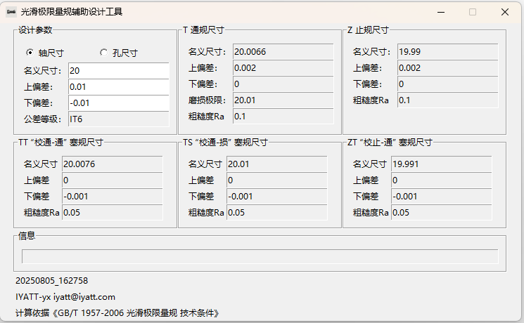

# plain-limit-gauge-designer 光滑极限量规辅助设计工具

  
计算依据 《GB/T 1957-2006 光滑极限量规 技术条件》  

前面我设计卡板、塞规的时候是用的网上找的一个软件，叫“通用量规辅助设计成 V1.22”，里面包含了光滑极限量规的设计计算，声明的是依据《GB1957-81》计算。这个软件估计是 XP 系统时代的，我在 Windows 11 上使用，需要把兼容模式设置为 XP 才能运行，设置 Win 7 都运行不了。  
另外我发现这个软件计算结果和现行国标 2006 版有差异，现在正好有空，就根据现行国标自己写了一个软件。

## 测试环境

* Python 3.13.1（支持 Windows 8 及以上）
